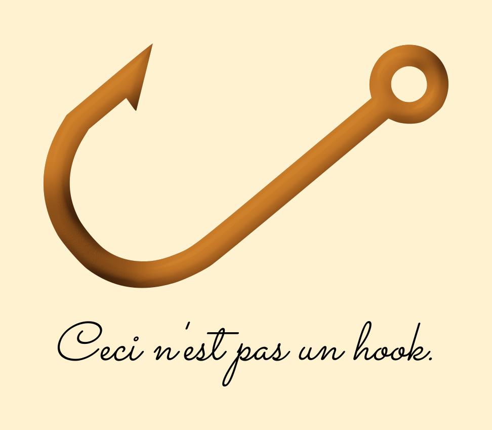

# ceci-hook

> Hook-style behavior reuse -- in any framework!

<center></center>

## Why do I want this?

I designed the API while I was working on some old React 15 code. I wanted the reusability and encapsulation that hooks provided, but couldn't use them for compatibility reasons. Once I realized that I only needed to permit a very specific use case, the API design became clear.

This package does not make any assumptions about your application and will work equally well in any frontend framework. (It's possible you could use it on the backend too, but I can't think of a use case.)

## Installation

```bash
npm install --save ceci-hook
```

## Usage

This package exposes a single export, `createEffect`, which accepts a side-effect callback describing any necessary setup and cleanup. `createEffect` returns an "almost-hook", which you must call manually to update. The almost-hook passes all of its arguments to your side-effect, and only calls the side-effect when its arguments change.

## Avoiding trouble

- **You must create a new almost-hook for each component.** Otherwise, you'll end up with strange, broken behavior. An easy way to create a new almost-hook is to set it up in a constructor.
- **You have to call the almost-hook yourself when it updates.** There's absolutely no magic going on here -- your code won't run if you don't call the almost-hook at the appropriate time.
- **Use closures if you don't want certain arguments considered for equality.** You have two places where you can provide information to your side-effect callback: during the callback's creation, and when you call the resulting almost-hook. Arguments passed to the almost-hook will be checked to see whether they've changed. Only use these arguments for values which will require you to update your side-effect behavior; pass other values in via closure. (See ["Using the Effect Hook"](https://reactjs.org/docs/hooks-effect.html) in the React documentation for an example of passing `document.title` in this way.)
- **Make sure you always provide the arguments in the same order.** If you must call your almost-hook from multiple places, double-check that you haven't swapped the order or forgotten any arguments. This could lead to difficult bugs.

## Example (React)

```javascript
import React from 'react';
import PropTypes from 'prop-types';
import createEffect from 'ceci-hook';

const noop = () => {};

export default class EffectExample extends React.Component {
  // Create the almost-hook.
  _fetchGreeting = createEffect((name) => {
    // `name` is set to `null` on component unmount, so don't do any setup and
    // don't return a cleanup callback either.
    if (!name) return null;

    let setGreeting = this._setGreeting;
    fetch(`/api/greet?username=${name}`)
      .then((response) => response.text())
      .then((greeting) => setGreeting(greeting));

    return () => {
      // Low-effort way to prevent a race condition.
      setGreeting = noop;
    }
  });

  // Utility function.
  _setGreeting = (greeting) => this.setState({ greeting });

  componentDidMount() {
    const {name} = this.props;
    
    // Call the almost-hook on mount.
    this._fetchGreeting(name);
  }

  componentDidUpdate() {
    const {name} = this.props;
    
    // Call the almost-hook on update.
    // Notice that because `ceci-hook` already checks whether your dependencies
    // have changed, you don't need to include any conditional logic here.
    this._fetchGreeting(name);
  }

  componentWillUnmount() {
    // Call the almost-hook on unmount.
    this._fetchGreeting(null);
  }

  render() {
    return (<div>Your customized greeting: {this.state.greeting}</div>);
  }
}
```

## Example (Vue)

```html
<template>
  <div>Your customized greeting: {{ greeting }}</div>
</template>
<script>
  import createEffect from 'ceci-hook';

  const noop = () => {};

  export default {
    name: 'EffectExample',
    
    props: {
      name: String,
    },
    
    data() {
      return {
        name: null,
      };
    },
    
    created() {
      // Create the almost-hook.
      this._fetchGreeting = createEffect((name) => {
        // `name` is set to `null` on component unmount, so don't do any setup and
        // don't return a cleanup callback either.
        if (!name) return null;
    
        let setGreeting = (greeting) => {
          this.greeting = greeting;
        };
        fetch(`/api/greet?username=${name}`)
          .then((response) => response.text())
          .then((greeting) => setGreeting(greeting));
    
        return () => {
          // Low-effort way to prevent a race condition.
          setGreeting = noop;
        }
      });
      
      // Call the almost-hook with the initial value, so that
      // the greeting is displayed as soon as possible.
      this._fetchGreeting(this.name);
    },
    
    beforeUpdate() {
      // Update our almost-hook. Note that no conditional logic is
      // required because `ceci-hook` only runs your side-effect if
      // its arguments have changed.
      this._fetchGreeting(this.name);
    },
    
    beforeDestroy() {
      // Run cleanup, in case a network call was in progress
      // when the component was unmounted.
      this._fetchGreeting(null);
    },
  };
</script>
```